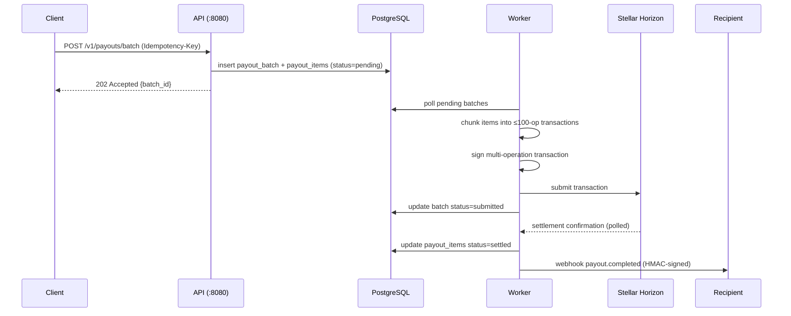
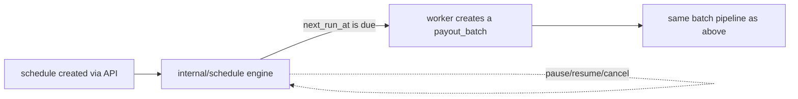
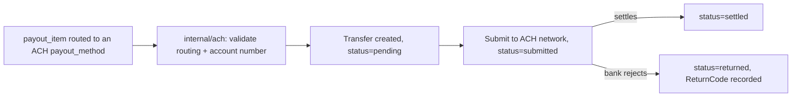
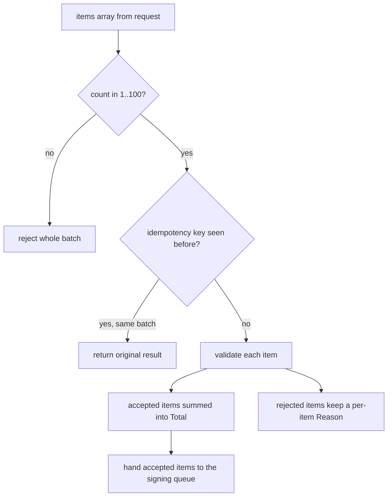

# Payment Flow

This document diagrams how a payout batch moves from API request to settled funds and a delivered webhook, and how the ACH and recurring-schedule rails feed into the same pipeline.

## End-to-end batch payout

## Recurring schedules feeding into batches

A schedule (`internal/schedule`) never touches Stellar directly — when it becomes due, it produces an ordinary `payout_batch` row that flows through the same signing and settlement path as a batch submitted directly through the API.

## ACH as an alternate settlement rail

Recipients whose `payout_methods.type` is `ach` bypass Horizon entirely: `internal/ach` validates the routing number (ABA checksum) and account number, then tracks the transfer through `pending → submitted → settled`, or `returned` if the receiving bank rejects it (e.g. NACHA code `R01` for insufficient funds).

## Batch validation before signing

`internal/batch` performs this per-item validation before any item reaches the Stellar signing queue, so one malformed recipient in a 50-recipient payroll run doesn't block the other 49.
